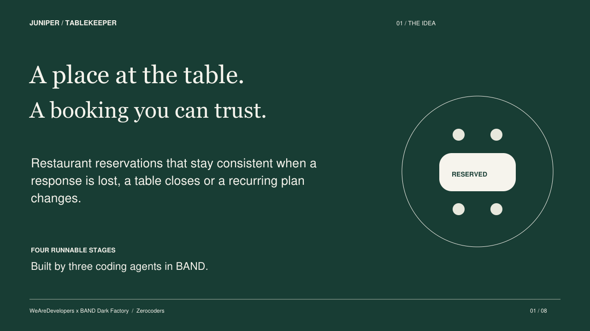

# Juniper Tablekeeper

A restaurant reservation service built by three coding agents in BAND for the WeAreDevelopers × BAND Dark Factory hackathon. Team: **Zerocoders**. Track: **tablekeeper**.



**All four product stages are accepted.** The final product is `25ade1c7add9a5701a511e07f79a619a3cb21b51`; independent evidence is `96329db1347c0e8b555282e22a35785643020d04`, and Coordinator gate is `693f9ec5d4c2df6353a15f002ffb601bf765d13a`. The unchanged official isolated run passed all four stages.

This is an operator-packaged public source selection from the actual factory delivery. It retains the accepted runtime bytes, full native room download, reusable mandates, functional guides, test sources and decision reports. Its public Git commits represent packaging; they do not replace the original factory commit history. [Manifest](DELIVERY-MANIFEST.json) and [source history](SOURCE-HISTORY.tsv) bind both lineages. Factory-authored documents are retained unchanged in [factory-documents](factory-documents/); statements there about a missing export describe their earlier authoring time. The operator subsequently obtained the genuine export and prepared the actual PDF/video.

## Start the full Stage 4 service

Requires Docker and Python 3. The service itself uses Python's standard library. Run from the repository root:

```sh
python3 tools/verify_runtime.py
cd stage-4
docker build -t juniper-tablekeeper-stage4 .
docker run --rm --name juniper-tablekeeper-demo --cpus=2 --memory=2g --read-only --tmpfs /tmp:rw,noexec,nosuid,size=64m -e PORT=8080 -p 127.0.0.1:8080:8080 juniper-tablekeeper-stage4
```

In a second terminal, load synthetic data from the repository root:

```sh
curl -fsS -X POST http://127.0.0.1:8080/_test/reset -H 'Content-Type: application/json' --data-binary @stage-4/demo-fixture.json
```

Open **http://127.0.0.1:8080/**. Health is at `/health`. [Stage 4 RUN](stage-4/RUN.md) documents fixture accounts and contracts. Reset replaces all demo state. Each `stage-1` through `stage-4` folder is independently buildable.

## Functionality

- Search in the restaurant's IANA timezone by local date and party size; book a single table or declared pair.
- Sign up, sign in, look up and cancel reservations in the responsive diner browser.
- Recover a committed booking after response loss using the same request body and idempotency key. Read current seating separately from the immutable original receipt.
- Amend reservations and move multiple bookings atomically through the API.
- Publish dated booking policies; retain accepted terms, truthful history and optimistic revisions.
- Create recurring agreements and amend future occurrences collectively.
- Preview an exact closure seating plan, then apply the recorded plan atomically through the manager API.
- Export and import validated service state across independently runnable stages.

[Complete Russian feature guide](FEATURES.md) · [Offline HTML guide](FEATURES.html) · [Factory explanation](FACTORY.md) · [API and setup](stage-4/RUN.md)

The browser serves diners. Manager, recurring and policy functions are API operations. State is in memory and requires explicit export/import across restart. The challenge's unauthenticated test controls and non-expiring demo sessions are deliberately retained; this is a local synthetic service, with no payments or live restaurant integration.

## Verification and retained failures

The exact final review reconciles **216 frozen, 344 independent and 158 official definitions to PASS**. These are definition counts, not HTTP request totals. The raw final review records **839 PASS / 53 original FAIL executions**: 49 opaque snapshot selector mismatches and four malformed-email oracle conflicts are retained and explicitly reconciled. All ten demonstrated defect families and ten stage transfer edges pass.

- [Independent exact-revision decision](reports/stage-4/REVIEW-25ade1c.md)
- [Full case matrix](reports/stage-4/case-matrix-25ade1c.json)
- [Original nonpass dispositions](reports/stage-4/NONPASS-RECONCILIATION-25ade1c.json)
- [All ten transfers](reports/stage-4/TRANSFER-MATRIX-25ade1c.json)
- [Load metrics](reports/stage-4/LOAD-METRICS-25ade1c.md)
- [Source bindings](reports/stage-4/SOURCE-BINDING-25ade1c.json)

More than 100 distinct supplied security/load scenarios were executed. Their original sources and explicit email-oracle correction are retained under [qa/frozen](qa/frozen/). The 45 final attempts, original logs and artifact manifests are archived separately as `juniper-stage4-25ade1c-evidence.zip`; its SHA256 is `cd6cc7f1c26f0e7c5a8d0e3cd66ab2d7c39b3445440bacb0374a4fa21332f115`. Historical failures are evidence, not discarded to create a green report. Relative links inside unmodified original reports may point into that evidence archive rather than this reduced public tree.

## Submission media and factory provenance

[Pitch deck — PDF, eight checked pages](media/pitch.pdf) · [Actual demonstration — MP4, 2:47](media/demo.mp4)

The video combines labelled presentation cards, edited genuine browser observations, seven real synthetic manager/series API responses and a continuous BAND room fragment. Idle gaps were removed. It is silent with English captions; no generated product UI is presented as a recording.

`room.json` is the actual unchanged native full-room download, exported 2026-10-05 at 15:44:18 UTC. It includes 10,965 messages, the original initial task, three real seats and the final documentation handoff. No room events were fabricated, filtered or merged. Final export coverage and original hashes are recorded in the delivery manifest. Later operator publication and event-submission receipts are separate from this autonomous factory trace.

The reusable Coordinator, Builder and Verifier [mandates](mandates/) describe the genuine roles. Original source author/committer information is retained in `SOURCE-HISTORY.tsv`. Exact runtime hashes are verified by `python3 tools/verify_runtime.py`.
